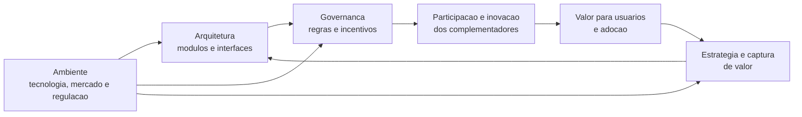

# Ecossistema de Plataforma em Amrit Tiwana

**Data da pesquisa:** 14 de agosto de 2026  
**Escopo:** ecossistemas de plataformas digitais extensiveis por complementos (apps, modulos, integracoes, dispositivos ou servicos de terceiros).  
**Obra central:** TIWANA, Amrit. *Platform Ecosystems: Aligning Architecture, Governance, and Strategy*. Morgan Kaufmann, 2014.

## Resumo executivo

Para Amrit Tiwana, uma plataforma nao deve ser compreendida apenas como tecnologia nem apenas como um marketplace. Ela e uma **base tecnologica extensivel**, cuja evolucao depende da coordenacao entre tres dimensoes: **arquitetura**, **governanca** e **estrategia**, em um ambiente que tambem muda. O ecossistema e a rede socio-tecnica que se forma em torno dessa base: proprietario da plataforma, complementadores, usuarios, interfaces, regras, recursos e relacoes de criacao e captura de valor.

O problema central que o conceito resolve e a coordenacao de inovacao distribuida: como permitir que terceiros inovem sobre uma base comum sem perder interoperabilidade, qualidade, confianca ou capacidade de evolucao. A principal oportunidade e multiplicar variedade, velocidade de inovacao e cobertura de casos de uso sem que o proprietario construa tudo sozinho. O risco correspondente e abrir demais, gerar fragmentacao e baixa qualidade, ou fechar demais, afastar complementadores e reduzir a relevancia da plataforma.

Tiwana nao oferece um unico KPI universal para todos os ecossistemas. A metrificacao coerente com seu modelo deve observar, conjuntamente, saude do ecossistema, qualidade/evolucao arquitetural, efetividade da governanca e criacao/captura de valor. O trio **produtividade, robustez e criacao de nichos**, de Iansiti e Levien, e uma base complementar muito usada para a dimensao de saude.

## Definicao do conceito

### Plataforma e ecossistema

Na formulacao de Tiwana, uma plataforma de software e uma base de codigo extensivel que concentra funcionalidades compartilhadas e oferece interfaces pelas quais modulos complementares interoperam com ela. A plataforma, isoladamente, e o nucleo tecnico; o **ecossistema de plataforma** e a unidade de analise mais ampla: o nucleo, os complementos, os participantes e as regras que organizam sua evolucao.

Uma definicao operacional para esta apresentacao e:

> Um ecossistema de plataforma e um arranjo socio-tecnico em que um nucleo digital compartilhado, suas interfaces e sua governanca permitem que atores relativamente autonomos criem, distribuam, combinem e usem complementos interoperaveis, coevoluindo com a plataforma e com o ambiente.

Esta e uma sintese fiel ao enquadramento de Tiwana; nao e uma citacao literal. O artigo de Tiwana, Konsynski e Bush estabelece explicitamente como premissa que a coevolucao entre design/arquitetura, governanca e dinamicas ambientais influencia a evolucao de ecossistemas baseados em plataformas [2].

### Elementos que precisam existir

| Elemento | Papel no ecossistema | Pergunta diagnostica |
| --- | --- | --- |
| Nucleo da plataforma | Capacidades comuns e relativamente estaveis | O que todo complemento reutiliza? |
| Interfaces e regras tecnicas | APIs, SDKs, eventos, modelos de dados, padroes de compatibilidade | Terceiros conseguem integrar sem depender de conhecimento privado? |
| Complementos | Apps, modulos, integracoes, conteudo, dispositivos ou servicos que adicionam valor | Que valor relevante existe fora do nucleo? |
| Proprietario ou orquestrador | Define fronteiras, evolucao, acesso e captura de valor | Quem decide o que e aberto, certificado, alterado ou retirado? |
| Complementadores | Empresas, desenvolvedores ou comunidades que investem para inovar sobre a base | Eles tem incentivo, previsibilidade e retorno para permanecer? |
| Usuarios e adotantes | Escolhem, usam e por vezes avaliam plataforma e complementos | O uso dos complementos melhora a utilidade da plataforma? |
| Governanca | Regras, processos, incentivos, contratos, certificacao e resolucao de conflitos | Como liberdade, qualidade e distribuicao de valor sao equilibradas? |

### O modelo de coevolucao

O ponto distintivo de Tiwana e rejeitar a leitura em que arquitetura, governanca e estrategia sao decisoes independentes. Elas se condicionam mutuamente ao longo do tempo:

1. A **arquitetura** determina fronteiras de modulo, estabilidade de interfaces, custos de integracao e o que terceiros podem inovar sem alterar o nucleo.
2. A **governanca** define quem pode entrar, que regras deve cumprir, como recebe suporte, como conflitos sao resolvidos e como o valor e repartido.
3. A **estrategia** escolhe onde abrir ou controlar, em que capacidades investir e como competir, diferenciar e capturar parte do valor criado.
4. O **ambiente** inclui tecnologia, concorrentes, regulacao, expectativas dos usuarios e movimentos dos complementadores. Ele muda os incentivos e cria pressao para rever as tres dimensoes anteriores.

Uma alteracao em API pode inviabilizar complementos; uma politica de cobranca pode reduzir entrada de desenvolvedores; a perda de complementadores pode reduzir valor para usuarios e, portanto, a atratividade da plataforma. Sao ciclos de retroalimentacao, nao uma cadeia linear.

### Limites conceituais importantes

- **Nao e sinonimo de marketplace.** Uma app store pode combinar ecossistema tecnologico e mercado multilateral, mas uma plataforma de APIs ou extensoes pode ter ecossistema sem intermediar transacoes entre compradores e vendedores.
- **Nao e uma cadeia de fornecedores.** Complementadores conservam autonomia e podem inovar, competir e cooperar. A interdependencia e organizada por interfaces e regras, nao apenas por contrato de fornecimento.
- **Nao e somente uma comunidade.** Comunidade sem nucleo reutilizavel, interfaces e governanca pode ser valiosa, mas nao necessariamente constitui um ecossistema de plataforma.
- **Nao se limita a software puro.** O enquadramento se aplica com mais clareza a plataformas baseadas em software, mas complementos podem incluir hardware, dados, conteudo ou servicos.

## Problemas que o conceito ajuda a resolver

| Problema | Tensao que Tiwana torna visivel | Decisao ou resposta esperada |
| --- | --- | --- |
| Escala de inovacao | O proprietario nao consegue atender todos os casos de uso sozinho. | Abrir interfaces e modularizar pontos de extensao para deslocar inovacao a complementadores. |
| Coordenacao sem hierarquia | Participantes autonomos precisam interoperar e cumprir expectativas comuns. | Definir contratos tecnicos, certificacao, documentacao, suporte e mecanismos de resolucao de disputas. |
| Abertura versus controle | Mais acesso pode acelerar inovacao, mas tambem elevar risco, fragmentacao e custos de suporte. | Escolher granularmente o que abrir, para quem, sob quais regras e com que nivel de controle. |
| Evolucao sem quebrar o ecossistema | O nucleo precisa mudar, mas mudancas podem destruir investimentos dos parceiros. | Versionar interfaces, publicar deprecacoes, oferecer compatibilidade e planejar transicoes. |
| Qualidade e confianca | O usuario percebe a experiencia do complemento como parte da plataforma. | Estabelecer requisitos de seguranca, desempenho, privacidade, observabilidade e curadoria proporcionais ao risco. |
| Criacao e captura de valor | Participantes so continuam investindo se percebem retorno justo e previsivel. | Definir precos, reparto de receita, direitos sobre dados, visibilidade e limites para competicao do proprietario com parceiros. |
| Priorizacao estrategica | O owner pode tentar transformar cada capacidade em recurso nativo e sufocar parceiros. | Delimitar o nucleo e os espacos de inovacao complementar de acordo com vantagem competitiva e saude do ecossistema. |

## Oportunidades estrategicas

1. **Variedade e cobertura de nichos.** Complementadores podem servir segmentos, regioes e fluxos especializados que nao justificariam investimento direto do proprietario.
2. **Inovacao paralela.** Um conjunto de participantes experimenta em paralelo, reduzindo o tempo para descobrir usos valiosos e tecnologias promissoras.
3. **Efeitos de rede de inovacao.** Mais complementos relevantes podem aumentar a atratividade para usuarios; mais usuarios podem, por sua vez, melhorar a oportunidade economica para complementadores. Esse efeito nao e automatico: depende de qualidade, descoberta e governanca.
4. **Economias de escopo.** Um investimento no nucleo e em interfaces pode ser reutilizado por muitos complementos, reduzindo custo marginal de atender novos casos.
5. **Dados e aprendizado do ecossistema.** Eventos de integracao, uso e suporte tornam visiveis gargalos e demandas, orientando a evolucao de APIs, documentacao e produto.
6. **Resiliencia por diversidade.** A existencia de varios complementadores e abordagens reduz dependencia de uma unica solucao, desde que a arquitetura evite concentracao excessiva em componentes criticos.

### Condicoes para a oportunidade se realizar

Oportunidade nao decorre de simplesmente publicar uma API. E necessario que haja: problema relevante para usuarios; fronteiras tecnicas compreensiveis; custo de entrada aceitavel; documentacao e ferramentas; retorno economico ou estrategico para parceiros; regras previsiveis; e capacidade de curadoria. Sem esses elementos, contar integracoes ou desenvolvedores cadastrados mede interesse superficial, nao um ecossistema viavel.

## Metrificacao

### Principio: medir o sistema, nao apenas o owner

O modelo de Tiwana pede um painel balanceado, pois uma metrica isolada induz decisoes ruins. Por exemplo, maximizar o numero bruto de apps pode reduzir qualidade; maximizar controle pode retardar inovacao; maximizar a receita do proprietario pode desincentivar parceiros. A unidade de observacao deve incluir pelo menos plataforma, complementadores, usuarios e relacoes entre eles.

**Distincao de atribuicao:** a organizacao em arquitetura, governanca, estrategia e ambiente vem de Tiwana [1, 2]. O trio produtividade, robustez e criacao de nichos e a conhecida lente de saude de Iansiti e Levien [6]. Os KPIs abaixo sao uma operacionalizacao proposta para diagnostico e gestao; eles nao devem ser apresentados como uma lista canonica ou exclusiva publicada por Tiwana.

### Painel recomendado

| Dimensao | Pergunta de gestao | Indicadores possiveis | Sinal de alerta |
| --- | --- | --- | --- |
| Produtividade do ecossistema | O ecossistema transforma esforco em valor utilizavel? | Tempo de onboarding ate primeiro complemento funcional; tempo de integracao; taxa de publicacao qualificada por complementador ativo; cadencia de releases; custo de suporte por integracao ativa. | Muitos cadastros, poucas integracoes ativas ou aumento persistente do tempo de entrega. |
| Robustez | O ecossistema suporta falhas, mudancas e saida de participantes? | Retencao de complementadores e usuarios; sobrevivencia de complementos em 12 meses; disponibilidade e taxa de erro das APIs; percentual de migracoes bem-sucedidas; concentracao em parceiros/componentes criticos. | Churn alto apos mudanca de politica ou API; dependencia de poucos parceiros; regressao de confiabilidade. |
| Criacao de nichos | Novos usos, segmentos e propostas de valor estao surgindo? | Numero de categorias com uso recorrente; diversidade de segmentos atendidos; percentual de complementos em casos de uso novos; receita/uso de complementos lancados recentemente; distribuicao de atividade entre categorias. | Crescimento concentrado somente em um tipo de complemento ou queda de experimentacao. |
| Arquitetura | A base permite extensao sem acoplamento e sem instabilidade excessiva? | Taxa de mudancas quebradoras; cobertura e adocao de versoes de API; taxa de sucesso de chamadas; latencia p95; tempo de recuperacao; percentual de integracoes que usam extensoes suportadas versus workarounds privados. | APIs instaveis, forks, integracoes por scraping ou crescimento de suporte manual. |
| Governanca | Regras e processos incentivam participacao confiavel e justa? | Tempo de aprovacao/publicacao; taxa e motivo de rejeicao; tempo de resolucao de incidentes e disputas; cumprimento de SLA; distribuicao de receita; NPS ou pesquisa de confianca de parceiros; taxa de recursos/reversoes de moderacao. | Processo opaco, fila crescente, queda de confianca ou concentracao de beneficios sem justificativa. |
| Valor para usuarios | Complementos melhoram de fato a proposta de valor? | Adocao de complementos por coorte; retencao e expansao de usuarios com e sem complemento; satisfacao; taxa de tarefa concluida; conversao; incidentes de seguranca/privacidade. | Complementos publicados, mas pouco descobertos, pouco usados ou associados a pior experiencia. |
| Valor e sustentabilidade | O valor criado sustenta owner e parceiros sem extracao predatoria? | Receita/GMV quando aplicavel; margem incremental; receita media por parceiro ativo; custo de aquisicao e ativacao; taxa de monetizacao; receita concentrada nos maiores parceiros; retorno estimado do parceiro. | Receita do owner cresce enquanto parceiros relevantes deixam o ecossistema; subsidio sem caminho para sustentabilidade. |

### Definicoes de calculo exemplares

As formulas devem ser adaptadas ao tipo de plataforma e devem usar coortes, pois totais acumulados escondem abandono.

| Indicador | Formula ilustrativa | Uso correto |
| --- | --- | --- |
| Retencao de complementadores | $\frac{\text{complementadores da coorte ativos apos } n \text{ meses}}{\text{complementadores ativos no inicio da coorte}}$ | Comparar por data de entrada, categoria e modelo de monetizacao. |
| Ativacao tecnica | $\frac{\text{integracoes que concluem o evento de valor inicial}}{\text{integracoes que iniciaram onboarding}}$ | Definir evento de valor, por exemplo primeira chamada de producao bem-sucedida ou primeiro usuario atendido. |
| Taxa de mudanca quebradora | $\frac{\text{mudancas de interface que exigem alteracao do complemento}}{\text{mudancas totais de interface}}$ | Usar por versao e acompanhar o custo/tempo de migracao, nao apenas a contagem. |
| Diversidade de nichos | Indice de diversidade por categoria, segmento ou caso de uso, acompanhado da distribuicao de atividade. | Evita interpretar dez mil complementos quase identicos como diversidade real. |
| Confiabilidade da plataforma | $\frac{\text{requisicoes bem-sucedidas}}{\text{requisicoes totais}}$ e latencia por percentil | Segmentar por API, regiao e versao; media simples mascara caudas ruins. |
| Concentracao de atividade | Participacao dos 1, 5 ou 10 maiores parceiros no uso, receita ou dependencias criticas. | Concentracao nao e necessariamente ruim, mas exige plano de contingencia e avaliacao de poder de barganha. |
| Tempo para primeiro valor | Mediana entre credenciamento e primeira integracao que gera o evento de valor. | Melhor que media quando ha cauda longa; decompor em documentacao, homologacao e integracao. |

### Como usar as metricas em conjunto

- **Crescimento saudavel:** mais complementadores ativos, ativacao rapida, uso recorrente, diversidade de nichos e estabilidade de interface.
- **Crescimento fragil:** numero de apps ou parceiros sobe, mas retencao, qualidade, descoberta ou uso recorrente caem.
- **Abertura mal calibrada:** entrada e variedade sobem, enquanto incidentes, reprovacoes ou custo de suporte crescem mais depressa que o valor criado.
- **Controle excessivo:** confiabilidade pode subir no curto prazo, mas o tempo de aprovacao, a inovacao em nichos e a retencao de parceiros declinam.
- **Risco de dependencia:** receita ou funcionalidade concentrada em poucos participantes; a robustez exige observar esse risco mesmo quando o resultado financeiro atual e alto.

### Cadencia e governanca da medicao

1. Definir uma taxonomia de participantes, complemento ativo e evento de valor antes de coletar indicadores.
2. Estabelecer uma linha de base e analisar por coorte, segmento e versao de API; evitar apenas valores agregados.
3. Revisar semanalmente confiabilidade e funil de onboarding, mensalmente saude e governanca, e trimestralmente arquitetura, estrategia e reparto de valor.
4. Vincular cada decisao de arquitetura ou politica a uma hipotese mensuravel. Exemplo: uma nova API deve reduzir tempo para primeiro valor sem elevar incidentes ou abandono.
5. Combinar telemetria com pesquisa qualitativa de parceiros e usuarios. Dados de uso mostram o que ocorreu; entrevistas e feedback explicam por que ocorreu.

## Autores que corroboram ou complementam Tiwana

| Autor(es) | Contribuicao | Relacao com Tiwana |
| --- | --- | --- |
| Benn Konsynski e Ashley A. Bush | Coautores do artigo de 2010 sobre evolucao de plataforma. | Fundamentam diretamente a lente de coevolucao entre arquitetura, governanca e ambiente. |
| Annabelle Gawer | Integra perspectivas de inovacao e economia; diferencia plataformas internas, de cadeia de suprimentos e de industria. | Ajuda a delimitar o tipo de plataforma e a nao reduzir o conceito a um unico modelo de negocio. |
| Carliss Baldwin e C. Jason Woodard | Explicam arquitetura de plataformas pela separacao entre nucleo relativamente estavel e componentes variaveis. | Complementam a dimensao arquitetural e a ideia de fronteiras/modularidade. |
| Kevin J. Boudreau | Distingue conceder acesso de ceder controle; mostra empiricamente que abertura afeta inovacao de modos diferentes. | Qualifica a decisao de governanca: abertura nao e binaria nem isenta de trade-offs. |
| Marco Iansiti e Roy Levien | Propoem a saude do ecossistema como produtividade, robustez e criacao de nichos. | Fornecem a lente de metrificacao de saude que falta a um painel puramente financeiro. |
| Ron Adner | Define ecossistema como estrutura de alinhamento de um conjunto multilateral de parceiros para uma proposta de valor. | Complementa Tiwana ao enfatizar dependencias de parceiros necessarias para a proposta de valor chegar ao usuario. |
| Michael Jacobides, Carmelo Cennamo e Annabelle Gawer | Desenvolvem teoria de ecossistemas baseada em modularidade, regras e complementaridades. | Conecta arquitetura e governanca de Tiwana a uma explicacao mais ampla de fronteiras e captura de valor. |
| Geoffrey Parker e Marshall Van Alstyne | Formalizam efeitos de rede de dois lados em produtos de informacao. | Sao especialmente uteis quando o ecossistema tambem possui uma camada de mercado multilateral. |
| J. F. Moore | Populariza a metafora de ecossistema de negocios e a interdependencia de organizacoes. | Antecedente conceitual amplo; Tiwana o torna mais acionavel para plataformas baseadas em software. |

## Implicacoes praticas para analisar um caso

Ao avaliar uma plataforma concreta, responda primeiro:

1. Qual e o nucleo compartilhado e quais sao as interfaces de extensao?
2. Quem sao os complementadores, usuarios e demais lados relevantes?
3. Que problema de usuario os complementos resolvem que o nucleo nao deve resolver sozinho?
4. Onde a plataforma deve abrir acesso e onde precisa manter controle por seguranca, qualidade, estrategia ou regulacao?
5. Que investimento os parceiros fazem e como eles recuperam esse investimento?
6. Que mudancas de arquitetura ou politica podem quebrar esses incentivos?
7. Que evidencia mostraria saude: produtividade, robustez, diversidade de nichos, valor de usuario e sustentabilidade economica?

## Referencias

1. TIWANA, Amrit. *Platform Ecosystems: Aligning Architecture, Governance, and Strategy*. Waltham, MA: Morgan Kaufmann, 2014. ISBN 978-0-12-408066-9. Pagina editorial: <https://shop.elsevier.com/books/platform-ecosystems/tiwana/978-0-12-408066-9>.
2. TIWANA, Amrit; KONSYNSKI, Benn; BUSH, Ashley A. Research Commentary: Platform Evolution: Coevolution of Platform Architecture, Governance, and Environmental Dynamics. *Information Systems Research*, v. 21, n. 4, p. 675-687, 2010. DOI: <https://doi.org/10.1287/isre.1100.0323>.
3. GAWER, Annabelle. Bridging differing perspectives on technological platforms: Toward an integrative framework. *Research Policy*, v. 43, n. 7, p. 1239-1249, 2014. DOI: <https://doi.org/10.1016/j.respol.2014.03.006>.
4. BALDWIN, Carliss Y.; WOODARD, C. Jason. The architecture of platforms: A unified view. In: GAWER, Annabelle (ed.). *Platforms, Markets and Innovation*. Cheltenham: Edward Elgar, 2009, p. 19-44.
5. BOUDREAU, Kevin J. Open Platform Strategies and Innovation: Granting Access vs. Devolving Control. *Management Science*, v. 56, n. 10, p. 1849-1872, 2010. DOI: <https://doi.org/10.1287/mnsc.1100.1215>.
6. IANSITI, Marco; LEVIEN, Roy. *The Keystone Advantage: What the New Dynamics of Business Ecosystems Mean for Strategy, Innovation, and Sustainability*. Boston: Harvard Business School Press, 2004.
7. ADNER, Ron. Ecosystem as Structure: An Actionable Construct for Strategy. *Journal of Management*, v. 43, n. 1, p. 39-58, 2017. DOI: <https://doi.org/10.1177/0149206316678451>.
8. JACOBIDES, Michael G.; CENNAMO, Carmelo; GAWER, Annabelle. Towards a theory of ecosystems. *Strategic Management Journal*, v. 39, n. 8, p. 2255-2276, 2018. DOI: <https://doi.org/10.1002/smj.2904>.
9. PARKER, Geoffrey G.; VAN ALSTYNE, Marshall W. Two-Sided Network Effects: A Theory of Information Product Design. *Management Science*, v. 51, n. 10, p. 1494-1504, 2005. DOI: <https://doi.org/10.1287/mnsc.1050.0400>.
10. MOORE, James F. Predators and Prey: A New Ecology of Competition. *Harvard Business Review*, v. 71, n. 3, p. 75-86, 1993.

## Notas metodologicas e limites

- A fonte primaria para Tiwana e o livro de 2014; o artigo de 2010, revisado por pares, foi usado para verificar a formulacao de coevolucao. A pagina editorial do livro exigiu autenticacao no momento da pesquisa, por isso detalhes de conteudo foram triangulados com o artigo e com referencias academicas relacionadas.
- As metricas devem ser contextualizadas. GMV, por exemplo, e relevante em plataformas transacionais, mas pode ser irrelevante para uma plataforma de APIs ou uma plataforma interna.
- Correlacao entre crescimento de complementos e desempenho nao prova causalidade. Mudancas de arquitetura e governanca devem ser avaliadas por coortes, experimentos quando possivel e evidencia qualitativa dos participantes.
- "Ecossistema" pode ser usado de forma vaga em material de mercado. Nesta nota, o termo exige base compartilhada, interfaces, participantes autonomos e governanca; sem esses elementos, o uso e metaforico ou impreciso.