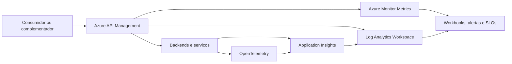

# KPIs Tecnicas, Observabilidade e APIs em um Ecossistema de Plataforma

**Data da sintese:** 15 de agosto de 2026  
**Escopo:** operacionalizacao tecnica da lente de ecossistemas de plataforma de Amrit Tiwana, com foco em observabilidade e APIs no Azure.

## Nota de atribuicao

Tiwana organiza a analise de ecossistemas pela coevolucao de arquitetura, governanca, estrategia e ambiente. Ele nao prescreve uma lista unica e canonica de KPIs tecnicos.

As metricas desta nota sao uma operacionalizacao desse modelo para plataformas extensaveis por complementos. Os componentes Azure sao meios tecnicos para instrumentar, observar e governar tais indicadores; eles nao fazem parte da obra de Tiwana.

## Principio de medicao

Uma API em funcionamento nao e evidencia suficiente de saude do ecossistema. A observabilidade deve indicar se as interfaces permanecem confiaveis, previsiveis e evolutiveis para os complementadores. Portanto, os indicadores precisam ser lidos em conjunto com a retencao de parceiros, a adocao de complementos e o valor entregue aos usuarios.

As tres fontes de evidencia se complementam:

- **Metricas:** deteccao rapida de disponibilidade, erro, saturacao e desempenho.
- **Logs:** contexto para diagnostico e analise por API, operacao, consumidor, versao e regiao.
- **Traces distribuidos:** percurso de uma transacao entre gateway, backend e dependencias.

## KPIs tecnicas prioritarias

| KPI tecnico | Pergunta de saude e evolucao | Forma de calcular ou observar | Componente Azure principal |
| --- | --- | --- | --- |
| Taxa de sucesso de API | As interfaces compartilhadas continuam utilizaveis pelos complementos? | $\frac{\text{requisicoes bem-sucedidas}}{\text{requisicoes totais}}$, por operacao, versao, regiao e consumidor. | Azure API Management; Azure Monitor Metrics. |
| Taxa de erro por operacao | Onde a interoperabilidade falha e quais parceiros sao afetados? | Erros 4xx/5xx, timeouts, falhas de autenticacao e incompatibilidades, segmentados por endpoint. | Azure API Management; Log Analytics Workspace. |
| Latencia de cauda | Os piores casos de desempenho inviabilizam a experiencia dos complementos? | Latencia p95 e p99 por operacao; a media pode esconder caudas ruins. | Azure API Management; Azure Monitor; Log Analytics com KQL. |
| Disponibilidade de interfaces | O nucleo e seus contratos estao disponiveis de forma previsivel? | Uptime/SLO de APIs, autenticacao, eventos, SDKs e servicos compartilhados. | Azure Monitor; Application Insights; Alert Rules. |
| Tempo de recuperacao | Quanta fragilidade operacional um incidente introduz para o ecossistema? | MTTR, reincidencia e numero de integracoes afetadas por incidente. | Azure Monitor; Application Insights; Action Groups. |
| Taxa de mudanca quebradora | A evolucao do nucleo preserva os investimentos dos complementadores? | $\frac{\text{mudancas de interface que exigem alteracao no complemento}}{\text{mudancas totais de interface}}$, por release. | API Management Versions and Revisions; Log Analytics. |
| Adocao de versoes | Os consumidores conseguem acompanhar a evolucao dos contratos? | Percentual de chamadas e integracoes em versoes suportadas, obsoletas ou em fim de vida. | Azure API Management; Log Analytics; Azure Monitor Workbooks. |
| Sucesso de migracoes | Deprecacoes e transicoes preservam a continuidade do ecossistema? | Percentual de migracoes concluidas, tempo para migrar, erros e reversoes por versao. | API Management Versions and Revisions; Application Insights; Log Analytics. |
| Tempo para primeiro valor tecnico | A arquitetura, documentacao e ferramentas reduzem a barreira de entrada? | Mediana entre credenciamento e o primeiro evento de valor, como uma chamada de producao bem-sucedida. | API Management Developer Portal; Application Insights; Log Analytics. |
| Ativacao tecnica | Em que ponto candidatos a complementadores abandonam a integracao? | $\frac{\text{integracoes que atingem o evento de valor}}{\text{integracoes que iniciaram onboarding}}$. | Application Insights; Log Analytics; Azure Monitor Workbooks. |
| Uso de extensoes suportadas | Os pontos oficiais de extensao sao suficientes e compreensiveis? | Percentual de integracoes que usam APIs, SDKs e eventos oficiais versus scraping, forks ou suporte manual. | Application Insights com eventos customizados; Log Analytics. |
| Custo de suporte por integracao ativa | A interface e a documentacao permitem autonomia operacional? | Tickets, horas de suporte e recorrencia por integracao, endpoint e versao. | Log Analytics; Azure Monitor Workbooks; integracao com a ferramenta de suporte. |
| Concentracao de dependencias | Poucos parceiros ou componentes criticos tornam o ecossistema fragil? | Participacao dos maiores parceiros ou dependencias em trafego, uso, receita ou funcionalidade critica. | Application Insights Application Map; Log Analytics; Azure Monitor Workbooks. |

## Componentes Azure e seu papel

| Componente | Papel no ecossistema de APIs | KPIs mais diretamente habilitados |
| --- | --- | --- |
| **Azure API Management** | Gateway e camada de governanca para publicar APIs, aplicar politicas, controlar acesso, organizar produtos e observar trafego na borda. | Taxa de sucesso, erros, latencia, consumo por operacao, versao e consumidor. |
| **API Management Versions and Revisions** | Permitem evoluir contratos por versao e revisar mudancas antes de promovelas amplamente. | Mudancas quebradoras, adocao de versoes, sucesso de migracoes e deprecacoes. |
| **API Management Developer Portal** | Apoia descoberta, documentacao, credenciamento e teste por consumidores e complementadores. | Tempo para primeiro valor e ativacao tecnica. |
| **API Management Request Tracing (API Inspector)** | Diagnostico imediato e pontual do processamento de uma requisicao no gateway. | Investigacao de falha e latencia de uma chamada especifica. |
| **Azure Monitor Metrics** | Serie temporal para deteccao rapida, SLOs e alertas de desempenho. | Disponibilidade, taxa de sucesso, taxa de erro e latencia. |
| **Azure Monitor Alerts e Action Groups** | Alertas baseados em metricas ou consultas e roteamento da resposta operacional. | SLOs, incidentes, MTTR e degradacao de dependencias. |
| **Log Analytics Workspace** | Repositorio central de logs e consultas KQL para diagnostico contextual. | Erros por operacao, versao e consumidor; adocao; migracoes; suporte e auditoria. |
| **Azure Monitor Workbooks** | Paineis investigativos e operacionais construidos sobre metricas e KQL. | Painel integrado de confiabilidade, adocao, versao e experiencia de integracao. |
| **Application Insights** | Telemetria de aplicacao, dependencias, excecoes, mapas de aplicacao e traces distribuidos. | Disponibilidade, latencia ponta a ponta, taxa de falha, dependencias e concentracao tecnica. |
| **OpenTelemetry** | Padrao de instrumentacao para propagar contexto e emitir traces, metricas e logs entre servicos. | Rastreabilidade ponta a ponta e diagnostico de gargalos entre gateway, backend e dependencias. |
| **Azure Managed Grafana** | Visualizacao operacional, especialmente quando ha metricas Prometheus, Kubernetes ou multiplas fontes. | Paineis de confiabilidade e capacidade em ambientes complexos. |
| **Azure Resource Graph Change Analysis e Activity Log** | Evidencia de mudancas de recursos e configuracoes para correlacionar alteracoes com incidentes. | Diagnostico de regressao apos mudancas de gateway, rota, infraestrutura ou politica. |
| **Azure Event Hubs** | Encaminhamento desacoplado de telemetria para SIEM, data lake ou ferramentas externas. | Retencao e analise especializada fora do Azure Monitor. |
| **Azure API Center** | Catalogo e governanca do inventario de APIs, complementar ao plano de execucao do APIM. | Cobertura de catalogo, padronizacao e descoberta do portfolio de APIs. |

## Arquitetura de referencia

## Configuracao-base recomendada

1. Posicionar o **Azure API Management** como ponto de entrada e governanca para APIs usadas por parceiros ou complementadores.
2. Habilitar metricas e logs diagnosticos do APIM por API e operacao, encaminhando os logs ao **Log Analytics Workspace**.
3. Instrumentar os backends com **OpenTelemetry** e **Application Insights**, propagando o contexto de trace entre gateway, servicos, filas, bancos e chamadas externas.
4. Definir SLOs de disponibilidade, taxa de sucesso e latencia p95/p99 por operacao critica; criar alertas para taxas, e nao apenas contagens absolutas.
5. Usar versoes e revisoes do APIM para publicar mudancas de contrato e observar a adocao antes de descontinuar uma versao.
6. Construir Workbooks que cruzem confiabilidade de API, adocao de versoes, ativacao tecnica e sinais de suporte.
7. Evitar registrar segredos, tokens, payloads sensiveis ou dados pessoais na telemetria. Aplicar mascaramento, controle de acesso e retencao proporcional ao objetivo operacional.

## Leituras e referencias

- `ecossistema-plataforma-amrit-tiwana.md`, secoes "O modelo de coevolucao", "Metrificacao" e "Cadencia e governanca da medicao".
- `relacao-desambiguacao-e-tiwana.md`, secoes "Como a conexao acontece" e "Uso recomendado na apresentacao".
- Microsoft Learn. [Observability in Azure API Management](https://learn.microsoft.com/azure/api-management/observability).
- Microsoft Learn. [Azure Monitor data platform](https://learn.microsoft.com/azure/azure-monitor/fundamentals/data-platform).
- Microsoft Learn. [Best practices for RESTful web API design: Enable distributed tracing and trace context in APIs](https://learn.microsoft.com/azure/architecture/best-practices/api-design#enable-distributed-tracing-and-trace-context-in-apis).