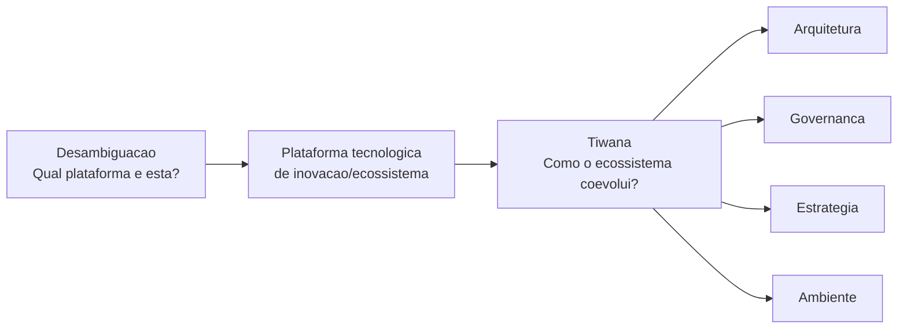

# Relacao entre a desambiguacao de plataforma e o ecossistema de Tiwana

**Data da sintese:** 14 de agosto de 2026  
**Documentos relacionados:** `desambiguacao-termo-plataforma.md` e `ecossistema-plataforma-amrit-tiwana.md`.

## Sintese central

Os dois documentos trabalham em niveis diferentes e complementares.

- A nota de desambiguacao e um **mapa taxonomico**: separa cinco sentidos recorrentes de "plataforma" para evitar que discussoes sobre arquitetura, mercado, nuvem e organizacao interna sejam tratadas como se fossem a mesma coisa.
- A nota sobre Amrit Tiwana e um **aprofundamento analitico** da segunda acepcao desse mapa: a **plataforma tecnologica de inovacao ou ecossistema**.

Em formula curta:

> A desambiguacao responde qual sentido de "plataforma" esta em jogo; Tiwana explica como analisar e gerir o caso em que a resposta e uma plataforma tecnologica extensivel por complementos.

## Comparacao das funcoes dos documentos

| Questao | Desambiguacao | Tiwana |
| --- | --- | --- |
| Funcao | Identificar de que tipo de plataforma se esta falando. | Explicar como um ecossistema de plataforma funciona e evolui. |
| Unidade de analise | Tipos de plataforma. | Ecossistema formado por nucleo, interfaces, complementadores, usuarios e governanca. |
| Criterio central | A relacao habilitada pela base compartilhada. | A coordenacao da inovacao distribuida sobre um nucleo extensivel. |
| Foco pratico | Evitar ambiguidade em requisitos, estrategia e apresentacoes. | Decidir arquitetura, abertura, governanca, evolucao e metricas. |
| Resultado | Uma classificacao operacional. | Um modelo de gestao e diagnostico. |

## Como a conexao acontece

A segunda acepcao da nota de desambiguacao define a plataforma tecnologica de inovacao ou ecossistema como uma base formada por componentes fundamentais e interfaces estaveis, sobre a qual complementadores criam produtos, servicos, modulos, aplicativos ou extensoes.

Tiwana desenvolve exatamente esse caso. Sua lente mostra que o funcionamento do ecossistema depende da coevolucao de quatro dimensoes:

1. **Arquitetura:** define o nucleo, a modularidade, as interfaces e os limites tecnicos para extensao.
2. **Governanca:** define quem entra, quais regras cumpre, como recebe suporte e como conflitos e valor sao tratados.
3. **Estrategia:** define onde abrir, onde controlar, em que capacidades investir e como capturar valor sem desincentivar parceiros.
4. **Ambiente:** tecnologia, concorrencia, regulacao, usuarios e movimentos dos complementadores alteram os incentivos das tres dimensoes anteriores.

Assim, a desambiguacao estabelece os criterios minimos para reconhecer o caso; Tiwana fornece o modelo para compreender suas tensoes e tomar decisoes nele.

## Limites entre o recorte de Tiwana e as demais acepcoes

As categorias da desambiguacao ajudam a evitar extensoes indevidas da lente de Tiwana.

| Acecao | Relacao com o ecossistema de Tiwana |
| --- | --- |
| Plataforma de computacao ou execucao | Pode sustentar um ecossistema, mas nao o implica. Um sistema operacional ou runtime torna-se objeto de Tiwana quando existem extensoes, atores autonomos e governanca. |
| Plataforma digital de mercado ou multilateral | Pode coexistir com um ecossistema, como em uma app store. Tiwana cobre sobretudo extensibilidade e coordenacao da inovacao; a teoria de mercados de dois lados aprofunda precificacao, matching e efeitos de rede. |
| PaaS | Descreve um modelo de entrega e responsabilidade operacional. Pode hospedar ou habilitar um ecossistema, mas nao e automaticamente um ecossistema de complementos. |
| IDP | E um produto para clientes internos. Pode aplicar principios de modularidade, interfaces e governanca de Tiwana quando admite extensoes e integracoes, mas seu objetivo principal e o autosservico de equipes internas. |

Uma API isolada tambem nao basta. Ela pode ser apenas uma capacidade tecnica. Para caracterizar um ecossistema de plataforma, e necessario haver uma base reutilizavel, interfaces compreensiveis, complementadores com incentivo para investir e governanca que coordene a evolucao.

## Uso recomendado na apresentacao

Uma narrativa clara pode seguir tres passos:

1. Comecar pelo mapa dos cinco sentidos de "plataforma" para resolver a ambiguidade do termo.
2. Declarar que o recorte da apresentacao e a plataforma tecnologica de inovacao ou ecossistema.
3. Introduzir Tiwana para mostrar que esse tipo de plataforma nao e apenas uma API nem apenas um marketplace: e uma coordenacao continua entre arquitetura, governanca, estrategia e ambiente.

Essa sequencia impede duas reducoes comuns: tratar toda base tecnica como ecossistema e tratar todo ecossistema como mercado multilateral.

## Referencias internas

- `desambiguacao-termo-plataforma.md`, secoes "2. Plataforma tecnologica de inovacao ou ecossistema", "Comparacao das cinco acepcoes" e "Recomendacoes de linguagem".
- `ecossistema-plataforma-amrit-tiwana.md`, secoes "Definicao do conceito", "O modelo de coevolucao", "Limites conceituais importantes" e "Implicacoes praticas para analisar um caso".