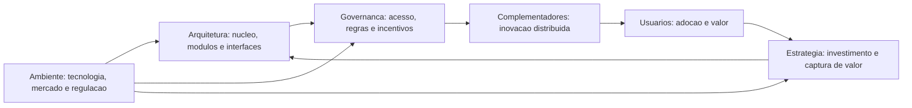
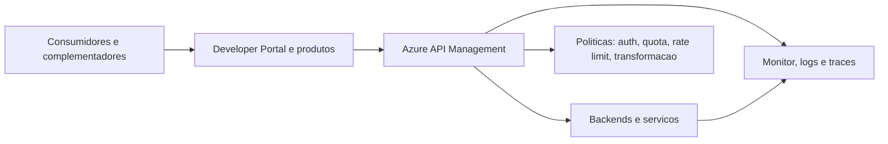
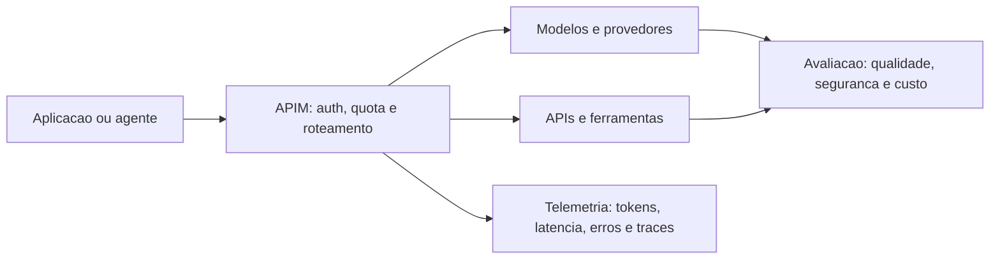

# Roteiro: Plataformas Digitais pela perspectiva de Amrit Tiwana

**Duracao:** 45 minutos  
**Publico:** principalmente arquitetos e desenvolvedores; adequado tambem para participantes de business  
**Tese central:** uma plataforma digital nao e apenas uma API, um produto ou um marketplace. Ela e uma base extensivel, cercada por interfaces, regras, participantes e incentivos que precisam coevoluir.

## Objetivos da palestra

Ao final, a audiencia deve conseguir:

- distinguir as principais acepcoes de plataforma;
- explicar onde a perspectiva de Amrit Tiwana se posiciona;
- separar propriedades conceituais da plataforma de metricas operacionais;
- relacionar Tiwana com a lente de efeitos de rede e mercados de *Platform Revolution*;
- identificar o papel do Azure API Management em uma plataforma digital;
- selecionar metricas que podem ser extraidas do APIM;
- reconhecer o que muda quando a plataforma passa a integrar LLMs.

## Mapa de tempo

| Bloco | Tema | Tempo acumulado |
| --- | --- | ---: |
| 1 | Abertura: uma API publicada ja e uma plataforma? | 3 min |
| 2 | Multiplas definicoes de plataforma | 9 min |
| 3 | O posicionamento de Tiwana | 16 min |
| 4 | Composability, Plasticity, Mutation e metricas | 25 min |
| 5 | Tiwana e *Platform Revolution* | 30 min |
| 6 | Azure API Management como peca da plataforma | 36 min |
| 7 | Metricas observaveis no APIM | 41 min |
| 8 | Extensao para LLMs | 44 min |
| 9 | Consideracoes finais | 45 min |

---

## 1. Abertura: uma API publicada ja e uma plataforma? — 3 min

### Objetivo

Criar uma pergunta comum para os dois publicos: tecnico e business.

### Slide sugerido

**Titulo:** Uma API publicada ja e uma plataforma?

Mostrar tres desenhos simples:

1. um servico interno com uma API;
2. uma API consumida por parceiros;
3. uma base com APIs, portal, politicas, versoes, complementos e usuarios.

### Fala sugerida

> Quando uma equipe publica uma API, ela criou uma plataforma? A resposta mais honesta e: depende do que estamos chamando de plataforma.
>
> Para uma pessoa de infraestrutura, plataforma pode ser o conjunto de capacidades que outras equipes consomem. Para uma area de produto, pode ser um produto-base com extensoes. Para estrategia, pode ser um mercado que conecta varios lados. Para um arquiteto, pode ser uma arquitetura modular com contratos estaveis.
>
> Essas respostas nao sao necessariamente contraditorias. Elas observam objetos diferentes. O problema aparece quando usamos a mesma palavra e tomamos decisoes diferentes sem perceber.

### Frase de transicao

> Antes de perguntar como medir uma plataforma, precisamos decidir qual plataforma estamos medindo.

---

## 2. Multiplas definicoes de plataforma — 6 min

### Objetivo

Dar um panorama sem tentar eleger uma definicao universal.

### Slide sugerido

**Titulo:** Plataforma e uma palavra com varios objetos

| Perspectiva | O que e plataforma? | Pergunta principal |
| --- | --- | --- |
| Tecnologica | Base reutilizavel com interfaces e extensoes | O que pode ser construido sobre ela? |
| Arquitetural | Nucleo relativamente estavel e modulos variaveis | Onde ficam as fronteiras e os contratos? |
| Produto | Capacidade-base oferecida a consumidores internos ou externos | Qual problema recorrente ela resolve? |
| Mercado | Intermediario entre lados com efeitos de rede | Como oferta e demanda se encontram? |
| Ecossistema | Rede socio-tecnica de owner, complementadores e usuarios | Como participantes autonomos coevoluem? |
| Organizacional | Forma de disponibilizar capacidades para varias equipes | Como reduzir duplicacao e acelerar entrega? |
| Infraestrutura | Servicos, identidade, observabilidade e governanca compartilhados | Como operar em escala? |

### Fala sugerida

> Uma plataforma tecnologica enfatiza reutilizacao. Uma plataforma de mercado enfatiza interacao e efeitos de rede. Uma plataforma de produto enfatiza proposta de valor. Uma plataforma de infraestrutura enfatiza escala, confiabilidade e operacao.
>
> O termo tambem aparece em contextos que nao devem ser confundidos: marketplace, plataforma interna, plataforma de dados, plataforma de APIs e plataforma de IA. Eles podem se sobrepor, mas nao sao sinonimos.
>
> Um marketplace pode ser uma camada de uma plataforma, mas nao e obrigatorio que toda plataforma seja um marketplace. Uma cadeia de fornecedores organiza dependencias contratuais, enquanto um ecossistema de plataforma pressupoe que complementadores relativamente autonomos inovem sobre uma base comum.

### Exemplo para business

Uma empresa pode dizer que possui uma plataforma porque tem muitos clientes. Isso descreve escala comercial, mas nao prova que exista uma base extensivel ou um ecossistema de complementadores.

### Exemplo para arquitetura

Um conjunto de microservicos internos pode ser uma plataforma para outras equipes se houver interfaces suportadas, documentacao, onboarding, versionamento, governanca e um evento de valor claro. Sem isso, pode ser apenas um conjunto de servicos compartilhados.

### Frase de transicao

> A perspectiva de Tiwana e especialmente util porque conecta a base tecnica aos participantes e as regras que tornam essa base sustentavel.

---

## 3. Onde Tiwana se posiciona — 7 min

### Objetivo

Apresentar a plataforma como nucleo tecnico extensivel e o ecossistema como unidade de analise.

### Slide sugerido

**Titulo:** Tiwana: arquitetura, governanca e estrategia coevoluem

### Fala sugerida

> Para Tiwana, a plataforma nao deve ser vista apenas como tecnologia. Ela e uma base de codigo ou capacidade compartilhada, extensivel por modulos complementares que usam interfaces da plataforma.
>
> O ecossistema inclui o nucleo, os complementos, os complementadores, os usuarios, as interfaces e as regras que organizam a evolucao. Por isso, a unidade de analise nao e somente o owner da plataforma.
>
> O ponto distintivo e a coevolucao. A arquitetura define o que e possivel integrar. A governanca define quem pode integrar, sob quais regras e com quais incentivos. A estrategia define onde abrir, onde controlar e como capturar valor. O ambiente muda e pressiona as tres dimensoes.

### O que o modelo torna visivel

- **Escala de inovacao:** o owner nao consegue construir todos os casos de uso sozinho.
- **Coordenacao sem hierarquia:** participantes autonomos precisam interoperar.
- **Abertura versus controle:** abertura acelera variedade, mas pode elevar risco e custo.
- **Evolucao sem quebrar:** o nucleo precisa mudar sem destruir investimentos dos complementadores.
- **Criacao e captura de valor:** parceiros permanecem quando existe retorno previsivel.

### Frase de precisao conceitual

> Tiwana nao oferece uma lista universal de KPIs para qualquer plataforma. O que ele oferece e uma lente para decidir o que precisa ser observado.

### Frase de transicao

> Se a plataforma e uma base extensivel que muda ao longo do tempo, precisamos de palavras para descrever como ela combina, se adapta e evolui.

---

## 4. Composability, Plasticity, Mutation e metricas — 9 min

### Objetivo

Explicar as propriedades pedidas e transforma-las em perguntas observaveis. Deixar claro que as metricas abaixo sao uma operacionalizacao para a palestra, e nao uma lista canonica de KPIs publicada por Tiwana.

### Slide sugerido

**Titulo:** Da propriedade arquitetural ao sinal operacional

| Propriedade | Definicao de trabalho | Pergunta de diagnostico |
| --- | --- | --- |
| **Composability** | Capacidade de combinar capacidades e componentes para formar novas solucoes | Um complemento consegue reutilizar e recombinar capacidades sem alterar o nucleo? |
| **Plasticity** | Capacidade de adaptar a plataforma a novos contextos, consumidores e requisitos | A base suporta novos casos de uso sem exigir uma reescrita estrutural? |
| **Mutation** | Capacidade de evoluir por mudancas controladas no nucleo, interfaces e complementos | A plataforma consegue mudar preservando compatibilidade e aprendizado? |
| Modularity | Separacao em partes com responsabilidades e contratos claros | E possivel mudar uma parte sem propagar acoplamento excessivo? |
| Extensibility | Existencia de pontos de extensao suportados | Terceiros conseguem adicionar valor por caminhos oficiais? |
| Evolvability | Capacidade de versionar, depreciar e migrar | O ecossistema acompanha a evolucao sem ruptura desnecessaria? |
| Interoperability | Capacidade de componentes diferentes funcionarem juntos | Os contratos sao compreensiveis, testaveis e observaveis? |
| Governance fit | Ajuste entre abertura, controle, risco e incentivos | A regra de acesso combina com o risco e com o valor esperado? |

### Fala sugerida: Composability

> Composability nao e apenas ter muitos endpoints. E poder combinar capacidades de maneira previsivel. Uma API de identidade, uma API de pedidos e um evento de pagamento podem formar uma nova experiencia sem que o complementador precise conhecer detalhes internos de cada servico.
>
> Sinais possiveis: tempo para montar uma integracao, percentual de uso de contratos oficiais, quantidade de capacidades combinadas por solucao e taxa de sucesso de composicoes em producao.

### Fala sugerida: Plasticity

> Plasticity e a capacidade de a plataforma se adaptar sem perder sua identidade. Uma plataforma plastica consegue atender uma nova regiao, um novo canal ou um novo tipo de consumidor sem criar uma copia incompatível para cada contexto.
>
> Sinais possiveis: tempo para atender um novo caso de uso, proporcao de componentes reutilizados, custo marginal de onboarding e numero de adaptacoes que exigem mudanca no nucleo.

### Fala sugerida: Mutation

> Mutation e evolucao. Toda plataforma precisa mudar: novas capacidades, novos contratos, novas politicas e novas dependencias. A pergunta nao e se havera mutacao, mas se ela e deliberada, reversivel quando necessario e legivel para quem depende da base.
>
> Sinais possiveis: taxa de mudancas quebradoras, adocao de versoes, sucesso de migracoes, tempo de depreciacao e regressao de confiabilidade apos releases.

### Painel balanceado

Organizar as metricas em quatro grupos:

1. **Arquitetura:** sucesso, latencia p95/p99, taxa de mudanca quebradora, adocao de versoes, uso de extensoes oficiais.
2. **Ecossistema:** complementadores ativos, ativacao, retencao, diversidade de nichos e concentracao de dependencias.
3. **Governanca:** tempo de aprovacao, rejeicoes, incidentes, disputas, cumprimento de SLA e custo de suporte.
4. **Valor:** adocao, retencao, expansao, receita quando aplicavel e retorno percebido pelos parceiros.

### Advertencia importante

> Contar APIs, integracoes ou desenvolvedores cadastrados mede atividade superficial. Uma plataforma pode crescer em cadastros e piorar em retencao, qualidade e valor. Por isso, metricas precisam ser lidas por coorte e relacionadas a eventos de valor.

### Frase de transicao

> Tiwana ajuda a explicar como a base e o ecossistema evoluem. *Platform Revolution* acrescenta uma pergunta diferente: como a plataforma organiza interacoes entre lados e captura valor dessas interacoes?

---

## 5. Tiwana e *Platform Revolution* — 5 min

### Objetivo

Relacionar as duas lentes sem trata-las como teorias concorrentes ou equivalentes.

### Slide sugerido

**Titulo:** Duas lentes para o mesmo sistema

| Pergunta | Tiwana | *Platform Revolution* |
| --- | --- | --- |
| Objeto principal | Ecossistema de plataforma e sua coevolucao | Plataforma de interacao e mercado multilateral |
| Foco | Arquitetura, governanca, estrategia e ambiente | Interacoes, efeitos de rede, liquidez e crescimento |
| Unidade de valor | Base + complementos + participantes | Interacao entre produtores e consumidores |
| Risco central | Ruptura, fragmentacao, governanca inadequada e perda de parceiros | Falta de liquidez, baixa confianca e efeitos de rede insuficientes |
| Pergunta operacional | Como evoluir a base sem destruir o ecossistema? | Como criar e escalar interacoes valiosas? |
| Metricas tipicas | Compatibilidade, evolucao, saude e sustentabilidade | Participacao, conversao, liquidez, aquisicao e valor por interacao |

### Fala sugerida

> Parker, Van Alstyne e Choudary popularizam uma lente de plataforma como intermediaria de interacoes entre lados. O valor nao esta somente no produto central, mas na capacidade de facilitar encontros, trocas e efeitos de rede.
>
> Essa lente e muito forte para perguntas de mercado: quantos lados existem, como eles entram, qual e a liquidez, como uma interacao e descoberta e como o crescimento de um lado torna a plataforma mais valiosa para o outro.
>
> Tiwana e mais forte para perguntas de arquitetura e ecossistema: quais interfaces permitem complementaridade, que governanca preserva os incentivos e como mudancas no nucleo afetam investimentos distribuidos.
>
> Uma plataforma de APIs pode ter grande relevancia para Tiwana sem ser um marketplace. Uma app store combina as duas lentes com mais clareza. Em ambos os casos, a pergunta e qual unidade de valor estamos tentando explicar.

### Relacao entre metricas

- **Composability** apoia a criacao de novas interacoes e produtos.
- **Plasticity** aumenta a capacidade de atender novos lados, segmentos e casos de uso.
- **Mutation** precisa preservar confianca e liquidez durante a evolucao.
- **Retencao e ativacao** sao simultaneamente sinais de saude do ecossistema e de capacidade de gerar interacoes repetidas.
- **Concentracao** pode indicar sucesso comercial, mas tambem dependencia e risco de governanca.

### Frase de transicao

> O Azure API Management aparece exatamente nessa fronteira: ele nao e o ecossistema inteiro, mas materializa contratos, politicas e sinais operacionais de uma parte importante dele.

---

## 6. Azure API Management como peca da plataforma — 6 min

### Objetivo

Explicar APIM em linguagem tecnica e de negocio, sem apresenta-lo como sinonimo de plataforma digital.

### Slide sugerido

**Titulo:** APIM e o ponto de controle entre capacidades e consumidores

### O papel do APIM

- publicar e descobrir APIs;
- organizar APIs em produtos e assinaturas;
- aplicar autenticacao, autorizacao, quotas, rate limits e transformacoes;
- controlar acesso e diferenciar consumidores;
- suportar versoes e revisoes;
- oferecer portal para documentacao, credenciais e testes;
- encaminhar telemetria para Azure Monitor, Log Analytics e Application Insights;
- criar uma fronteira observavel entre consumidores e backends.

### Fala sugerida

> O APIM e uma peca importante porque transforma uma chamada tecnica em um contrato governado. Ele ajuda a dizer quem pode chamar, quanto pode chamar, qual versao esta usando, que politica se aplica e como investigar uma falha.
>
> Mas APIM nao e a plataforma inteira. A plataforma inclui os backends, os dados, os eventos, a identidade, a experiencia do consumidor, a governanca, os complementos e o modelo de valor. APIM e uma camada central do nucleo de APIs e do plano de controle.

### Traducoes para os dois publicos

**Para arquitetura e desenvolvimento:** APIM reduz acoplamento na borda, centraliza politicas, sustenta contratos, versoes, observabilidade e protecao contra abuso.

**Para business:** APIM ajuda a empacotar capacidades, diferenciar consumidores, criar limites de uso, medir adocao e reduzir o risco de oferecer uma capacidade sem controle operacional.

### Frase de transicao

> Se APIM governa a borda da plataforma, seus sinais ajudam a observar se a base e realmente composable, plastica e capaz de evoluir.

---

## 7. Quais metricas podem ser extraidas do APIM — 5 min

### Objetivo

Conectar propriedades de Tiwana a evidencias tecnicas disponiveis na arquitetura.

### Slide sugerido

**Titulo:** O que o APIM torna observavel?

| Sinal | Metrica ou dimensao | Relacao com Tiwana |
| --- | --- | --- |
| Confiabilidade | taxa de sucesso, 4xx, 5xx, timeouts | Interoperabilidade e robustez |
| Desempenho | latencia p50, p95 e p99 por operacao | Qualidade do contrato e valor para o consumidor |
| Evolucao | adocao de versoes, chamadas a versoes obsoletas, mudancas quebradoras | Mutation e evolvability |
| Entrada | tempo de credenciamento ate primeira chamada valida | Plasticity e custo de onboarding |
| Composicao | uso de varias APIs ou produtos na mesma solucao | Composability |
| Governanca | consumo por produto, assinatura, consumidor e politica | Governanca e sustentabilidade |
| Resiliencia | incidentes, MTTR, dependencias e concentracao | Robustez do ecossistema |
| Suporte | erros recorrentes, tickets por integracao e custo de suporte | Qualidade da interface e autonomia dos complementadores |

### Fontes Azure

- **APIM e Azure Monitor Metrics:** volume, sucesso, erros e latencia.
- **Diagnostic logs e Log Analytics:** analise por API, operacao, consumidor, versao e regiao.
- **Application Insights:** dependencias, excecoes, traces e latencia ponta a ponta.
- **OpenTelemetry:** propagacao de contexto entre gateway, servicos, filas e dependencias.
- **Versions and Revisions:** evolucao controlada, deprecacao e migracao.
- **Developer Portal:** descoberta, credenciamento, documentacao e primeiro valor.
- **Workbooks e alertas:** acompanhamento operacional e SLOs.

### Exemplo de leitura

> Imagine que o numero de integracoes subiu 40%, mas a latencia p99 dobrou, chamadas a uma versao obsoleta cresceram e o custo de suporte por integracao aumentou. O indicador de crescimento isolado diria que a plataforma esta melhor. O painel de Tiwana diria que houve ganho de entrada com perda de robustez, evolucao e autonomia.

### Formula para mostrar no slide

$$
\text{Ativacao tecnica} =
\frac{\text{integracoes que atingem o primeiro evento de valor}}
{\text{integracoes que iniciaram onboarding}}
$$

Definir o evento de valor: por exemplo, primeira chamada de producao bem-sucedida, primeiro fluxo completo ou primeiro usuario atendido.

### Cuidados de telemetria

- nao registrar tokens, segredos, payloads sensiveis ou dados pessoais;
- segmentar por API, operacao, versao, consumidor e regiao;
- preferir percentis a medias para latencia;
- usar coortes para onboarding, retencao e migracao;
- cruzar telemetria com feedback de parceiros e usuarios.

### Frase de transicao

> Quando o complemento deixa de ser apenas uma API deterministica e passa a depender de um modelo probabilistico, a plataforma ganha novas dimensoes de custo, qualidade e governanca.

---

## 8. Como isso se estende para integracao com LLMs — 3 min

### Objetivo

Mostrar que LLMs ampliam, e nao eliminam, os problemas de plataforma.

### Slide sugerido

**Titulo:** Uma plataforma de LLM governa capacidade, contexto e incerteza

### O que permanece igual

- ha um nucleo de capacidades compartilhadas;
- consumidores e complementadores criam solucoes sobre esse nucleo;
- interfaces, politicas e incentivos precisam ser governados;
- versoes e mudancas podem quebrar consumidores;
- observabilidade e confianca determinam a saude do ecossistema.

### O que muda

| Dimensao | APIs tradicionais | Integracao com LLMs |
| --- | --- | --- |
| Resultado | geralmente deterministico | probabilistico e dependente de contexto |
| Custo | chamadas e recursos computacionais | tokens de entrada/saida, modelo e ferramentas |
| Qualidade | status, schema e regras | relevancia, groundedness, consistencia e avaliacao |
| Evolucao | versao de contrato | modelo, prompt, ferramenta, contexto e politica |
| Risco | autenticacao, abuso e indisponibilidade | prompt injection, vazamento, alucinacao e uso indevido |
| Metrica de valor | sucesso tecnico e tarefa concluida | tarefa concluida com qualidade, custo e seguranca aceitaveis |

### Metricas adicionais

- custo por tarefa e por token;
- latencia p95 do primeiro token e da resposta completa;
- taxa de fallback entre modelos;
- taxa de chamadas a ferramentas e falhas por ferramenta;
- qualidade por conjunto de avaliacao e por caso de uso;
- taxa de respostas sem evidencia quando grounding e necessario;
- incidentes de seguranca, privacidade e policy;
- concentracao em um provedor ou modelo;
- retencao de prompts, contexto e traces sob politica de privacidade.

### Fala sugerida

> LLMs tornam a composability mais poderosa: uma aplicacao pode combinar modelo, busca, APIs, ferramentas e regras de negocio. Mas tornam a mutation mais delicada: trocar o modelo ou o prompt pode alterar comportamento sem mudar o schema.
>
> Por isso, um gateway para LLMs precisa ser entendido como parte de uma governanca de capacidades probabilisticas. Rate limit e autenticacao continuam importantes, mas nao bastam. Precisamos avaliar qualidade, custo, seguranca, contexto e comportamento.

---

## 9. Consideracoes finais — 1 min

### Slide sugerido

**Titulo:** Tres ideias para levar

1. **Plataforma nao e um componente isolado.** E uma base extensivel combinada com interfaces, participantes, regras e incentivos.
2. **Metricas precisam acompanhar o sistema.** Crescimento de chamadas ou integracoes nao compensa perda de robustez, evolucao, qualidade e valor.
3. **APIM e LLMs ampliam a responsabilidade arquitetural.** Governar a borda significa governar contratos, consumo, custo, risco e capacidade de evolucao.

### Fala de encerramento

> A pergunta mais importante nao e “quantas APIs temos?” nem “qual modelo estamos usando?”. A pergunta e: que capacidade compartilhada estamos oferecendo, para quem, sob quais contratos e com que evidencia de que o ecossistema consegue evoluir?
>
> Uma plataforma saudavel permite que outros construam sobre ela sem transformar cada consumidor em uma excecao operacional. Essa e a ponte entre arquitetura, governanca, estrategia e valor.

### Pergunta final para a audiencia

> Na plataforma que voce esta construindo, qual propriedade esta faltando hoje: composability, plasticity, mutation ou governanca?

---

## Orientacoes de apresentacao

### Para manter o ritmo

- Nao ler as tabelas integralmente; usa-las como mapa visual.
- Repetir a sequencia `base -> interfaces -> complementadores -> usuarios -> governanca` ao longo da palestra.
- Para cada metrica tecnica, responder: “que decisao ela ajuda a tomar?”
- Evitar transformar Tiwana em uma lista de KPIs. Dizer explicitamente quando uma metrica e uma operacionalizacao proposta.
- Usar um unico exemplo transversal: APIs de dados de vinhos, integracoes de parceiros ou servicos de uma plataforma interna.

### Perguntas provaveis

**“Toda API Management ja e uma plataforma?”**  
Nao. APIM e uma peca de governanca e operacao de APIs. A plataforma depende tambem do nucleo de capacidades, dos consumidores, complementadores, contratos, experiencia e incentivos.

**“Uma plataforma precisa ser aberta?”**  
Nao de forma absoluta. Abertura deve ser calibrada por risco, valor, regulacao, confianca e necessidade de inovacao. O ponto e tornar as regras previsiveis.

**“Metricas tecnicas medem valor de negocio?”**  
So parcialmente. Latencia, erro e disponibilidade sao condicoes de valor. Para medir valor, e necessario conecta-las a ativacao, uso recorrente, tarefa concluida, retencao e retorno de participantes.

**“LLM substitui a API?”**  
Nao. LLM pode ser uma capacidade dentro de uma plataforma de APIs e ferramentas. Ele adiciona incerteza, custo variavel e necessidade de avaliacao comportamental.

---

## Referencias para a palestra

1. TIWANA, Amrit. *Platform Ecosystems: Aligning Architecture, Governance, and Strategy*. Morgan Kaufmann, 2014.
2. TIWANA, Amrit; KONSYNSKI, Benn; BUSH, Ashley A. Research Commentary: Platform Evolution: Coevolution of Platform Architecture, Governance, and Environmental Dynamics. *Information Systems Research*, 2010.
3. PARKER, Geoffrey G.; VAN ALSTYNE, Marshall W.; CHOUDARY, Sangeet Paul. *Platform Revolution: How Networked Markets Are Transforming the Economy and How to Make Them Work for You*. W. W. Norton, 2016.
4. IANSITI, Marco; LEVIEN, Roy. *The Keystone Advantage*. Harvard Business School Press, 2004.
5. Microsoft Learn. [Azure API Management documentation](https://learn.microsoft.com/azure/api-management/).
6. Microsoft Learn. [Observability in Azure API Management](https://learn.microsoft.com/azure/api-management/observability).
7. Microsoft Learn. [Azure Monitor data platform](https://learn.microsoft.com/azure/azure-monitor/fundamentals/data-platform).

## Nota metodologica

As definicoes de Composability, Plasticity e Mutation neste roteiro funcionam como propriedades de trabalho para conectar a teoria de plataformas a sinais observaveis em uma arquitetura de APIs. As metricas e formulas apresentadas sao uma operacionalizacao proposta para a palestra. Elas devem ser adaptadas ao tipo de plataforma, ao evento de valor e ao contexto de negocio; nao devem ser apresentadas como um catalogo universal ou como uma lista canonica de KPIs de Tiwana.
